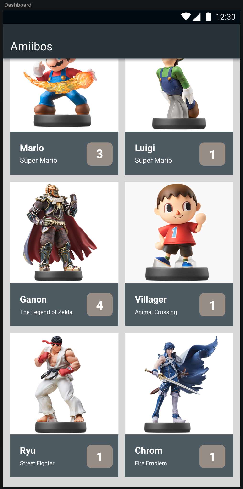
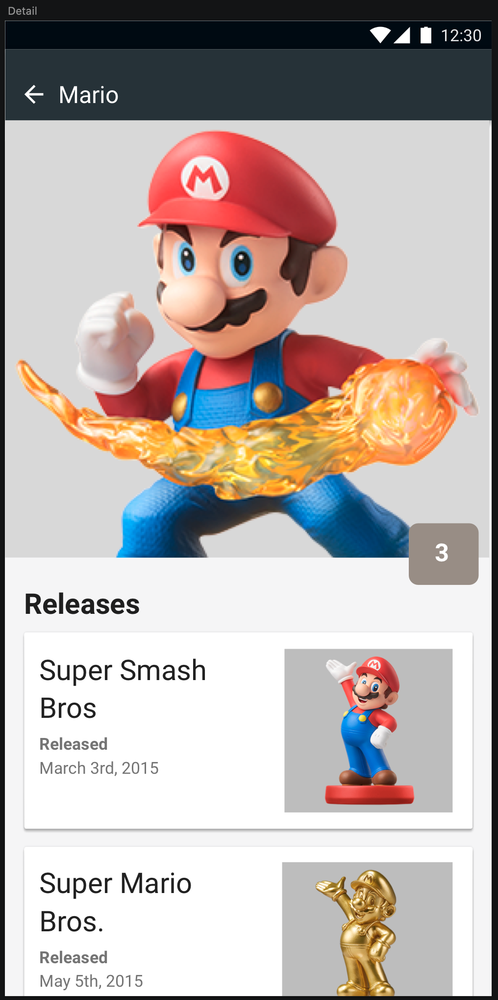

# Versus Systems Android Coding Challenge

Hello - and thanks for being interested in joining our team here at Versus Systems!

For this test we'd like you to continue building a small app.

We've taken care of a number of the more chore-like aspects of building this tiny app so you can focus on styling, architecture, organization, and core functionality.  You will find the project attached.

## The Ask

The app you'll be finishing will show a list of all available Nintendo Amiibos.
The data to build this can be found here: [AmiiboAPI](https://www.amiiboapi.com)

* Consume enough of the AmiiboAPI as required to build the views in the designs.
* Finish hooking up the necessary components required to meet the included designs.

* Each character tile on the dashboard should only show up once.
  * ie: 'Mario' will have multiple Amiibo's but he should only show up as one "tile" with the number badge next to him reflecting how many other Mario Amiibo's there are.

* The detail page after tapping on an Amiibo character will list all of the Amiibo's associated with a given character.
* You'll have to finish the layout on the detail page and bind / style it accordingly.

## Considerations

* Feel free to use whichever libraries or helpers you deem appropriate!

* Change WHATEVER you want!  It's your world and we want to see how you do things.

* The UI is hooked up but unstyled, please match the included designs.

* There's no need to include Unit Tests - a quick summary of what you'd test will suffice.

* We'd prefer to see you tackle the tasks in this order in case you lack the availability or the time to complete this code test exceeds our expected 4-6 hours:    
    1. API consumption and transformation
    2. Core Functionality - (Hooking up the API consumption to the existing testData flow and logic.)
    3. Completing the Detail View layout
    4. Matching and designing the designs
    5. Organization and improvements
    6. Filling out the 'your thoughts' section in this Readme
    7. Any stretch goals

## Delivery

When you finish, please send us a zip file.  We expect this should take roughly 4-6 hours, but feel free to spend as little or as much time as you feel is right to produce something you feel good about sharing.

## Your thoughts

* If given a week how would you improve your contribution to this project?
  * 2 weeks?
  * What would you focus on first and why?

## Stretch Goals

* Show off some CoRoutines in your implementation
* Show off some Jetpack Compose in your implementation
* Dashboard items sorted by name
* Better dashboard images
* Make the app prettier

## Designs

